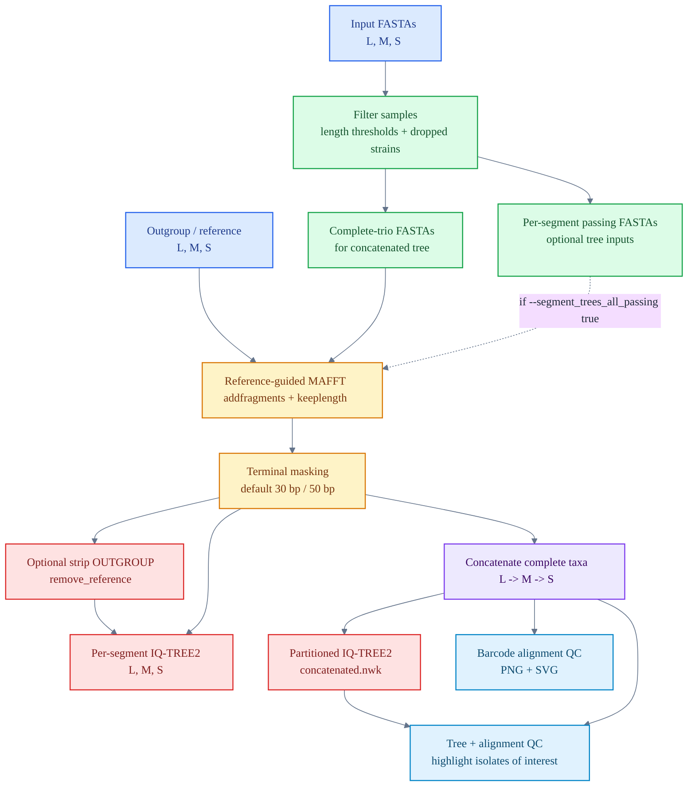

# Segmented Virus Phylogenetics Pipeline

A Nextflow DSL2 pipeline for tri-segmented virus phylogenetics. It filters L/M/S segment FASTAs, performs reference-guided alignment, masks terminal regions, builds per-segment trees, builds a complete-trio concatenated tree with segment partitions, and renders alignment QC plots with and without the phylogenetic tree.

The pipeline is designed for segmented viral genomes where a sample may have some segments missing. The concatenated tree is always built from samples present in all three segments, while per-segment trees can optionally include every sample that passes that segment's length threshold.

## Workflow



## Quick Start

```bash
nextflow run main.nf \
    --l_fasta  sequences_L.fasta \
    --m_fasta  sequences_M.fasta \
    --s_fasta  sequences_S.fasta \
    --root_l   config/outgroup_L.gb \
    --root_m   config/outgroup_M.gb \
    --root_s   config/outgroup_S.gb \
    --outdir   results \
    -profile   conda
```

Show the built-in help:

```bash
nextflow run main.nf --help
```

Run in a mode closest to the `hodcroftlab/andv` Nextstrain workflow:

```bash
nextflow run main.nf \
    --l_fasta          sequences_L.fasta \
    --m_fasta          sequences_M.fasta \
    --s_fasta          sequences_S.fasta \
    --root_l           config/outgroup_L.gb \
    --root_m           config/outgroup_M.gb \
    --root_s           config/outgroup_S.gb \
    --remove_reference true \
    --root             midpoint \
    --iqtree_model     GTR \
    --outdir           results_andv \
    -profile           conda
```

Build per-segment trees from all samples passing each segment threshold, while keeping the concatenated tree complete-trio only:

```bash
nextflow run main.nf \
    --l_fasta                    sequences_L.fasta \
    --m_fasta                    sequences_M.fasta \
    --s_fasta                    sequences_S.fasta \
    --root_l                     config/outgroup_L.gb \
    --root_m                     config/outgroup_M.gb \
    --root_s                     config/outgroup_S.gb \
    --segment_trees_all_passing  true \
    --outdir                     results_all_segment_samples \
    -profile                     conda
```

Highlight isolates of interest in the tree-plus-alignment plot:

```bash
nextflow run main.nf \
    --l_fasta            sequences_L.fasta \
    --m_fasta            sequences_M.fasta \
    --s_fasta            sequences_S.fasta \
    --root_l             config/outgroup_L.gb \
    --root_m             config/outgroup_M.gb \
    --root_s             config/outgroup_S.gb \
    --highlight_samples  config/highlight_samples.txt \
    --outdir             results_highlighted \
    -profile             conda
```

## Documentation

| Document | What it covers |
|----------|----------------|
| [Usage guide](docs/usage.md) | Practical run recipes, input checks, and common command patterns |
| [Pipeline steps](docs/pipeline.md) | Process-by-process explanation of filtering, alignment, masking, tree building, concatenation, and visualization |
| [Parameters](docs/parameters.md) | Full parameter reference, valid rooting combinations, and example commands |
| [Outputs](docs/outputs.md) | Published output files and how to interpret them |
| [Troubleshooting](docs/troubleshooting.md) | Common Nextflow, conda, and rerun issues |

## Inputs

Segment FASTA headers must use `SampleName|SEGMENT`:

```fasta
>StrainA|L
ATGCATGC...
>StrainB|L
ATGCATGC...
```

Provide one root/outgroup sequence per segment. FASTA and GenBank inputs are supported:

| Extension | Parsed as |
|-----------|-----------|
| `.fasta`, `.fa`, `.fna`, `.fas` | FASTA |
| `.gb`, `.gbk`, `.genbank` | GenBank |

Optional dropped-strain and highlighted-sample files are plain text, one sample name per line. Blank lines and lines beginning with `#` are ignored.

## Key Options

| Option | Default | Purpose |
|--------|---------|---------|
| `--remove_reference` | `false` | Remove `OUTGROUP` before tree building. Use with `--root midpoint`. |
| `--root` | `outgroup` | Root using `OUTGROUP` or post-process with midpoint rooting. |
| `--segment_trees_all_passing` | `false` | Let per-segment trees use all length-passing samples for that segment. |
| `--iqtree_model` | `GTR+G` | IQ-TREE2 model for per-segment trees and each concatenated partition. |
| `--iqtree_boot` | `1000` | Ultrafast bootstrap replicates. |
| `--dropped_strains` | `null` | Exclude named samples before length and completeness filtering. |
| `--highlight_samples` | `null` | Highlight selected samples in `alignment_tree.png/svg` with red labels and tree-tip markers. |

See [docs/parameters.md](docs/parameters.md) for the complete reference.

## Outputs

The main result is:

```text
results/03_trees/concatenated.nwk
```

The output folder also includes filtered FASTAs, per-segment alignments, per-segment trees, IQ-TREE2 logs, the concatenated partition file, and alignment QC plots:

```text
results/
├── 01_filtered/
├── 02_alignments/
├── 03_trees/
│   ├── concatenated.nwk
│   └── per_segment/
└── 04_visualization/
    ├── alignment_barcode.png
    ├── alignment_barcode.svg
    ├── alignment_tree.png
    └── alignment_tree.svg
```

See [docs/outputs.md](docs/outputs.md) for the full file-by-file guide.

## Requirements

| Tool | Version | Source |
|------|---------|--------|
| Nextflow | 23.04 or newer | User-installed |
| Python | 3.12 | `environment.yml` |
| Biopython | 1.86 | `environment.yml` |
| NumPy | 2.2.5 | `environment.yml` |
| Matplotlib | 3.10.5 | `environment.yml` |
| MAFFT | 7.526 | `environment.yml` |
| IQ-TREE2 | 2.3.5 | `environment.yml` |

All tools except Nextflow are managed by the `conda` profile:

```bash
-profile conda
```

Cluster execution can be combined with the conda environment:

```bash
-profile slurm,conda
```

## Repository Layout

```text
segvirus_tree/
├── main.nf
├── nextflow.config
├── environment.yml
├── README.md
├── docs/
│   ├── pipeline.md
│   ├── usage.md
│   ├── parameters.md
│   ├── outputs.md
│   └── troubleshooting.md
└── bin/
    ├── filter_complete_samples.py
    ├── add_outgroup.py
    ├── mask_alignment.py
    ├── strip_outgroup.py
    ├── midpoint_root.py
    ├── concatenate_alignments.py
    ├── visualize_alignment.py
    └── visualize_alignment_tree.py
```
